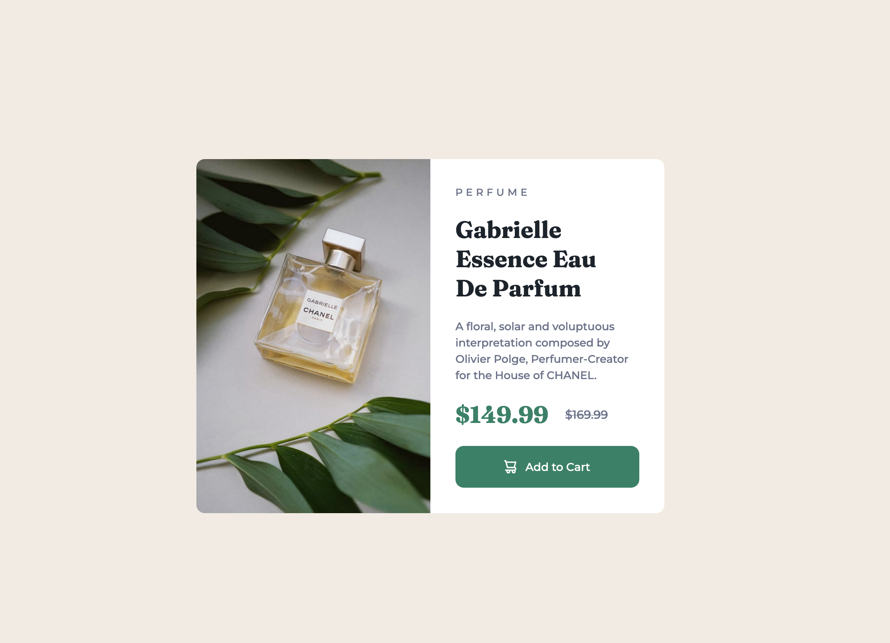

# Frontend Mentor - Product preview card component solution

This is a solution to the [Product preview card component challenge on Frontend Mentor](https://www.frontendmentor.io/challenges/product-preview-card-component-GO7UmttRfa). Frontend Mentor challenges help you improve your coding skills by building realistic projects. 

## Overview

### The challenge

Users should be able to:

- View the optimal layout depending on their device's screen size
- See hover and focus states for interactive elements

### Screenshot

#### Desktop

#### Mobile


## My process

### Built with

- HTML
- CSS
- Flexbox

### What I learned

Flexbox is really useful when you want to manipulate elements across the layout, making it really easy to center and justify them.

For example: 

```css
main {
    display: flex;
    align-items: center;
    justify-content: center;
    min-height: 100vh;
}
```
This allows the card element to be exactly at the center of the screen. The `min-height` property makes sure that the main section takes 100% of the viewport height, ensuring that the `align-items` property vertically centers the element exactly to the center of the screen.
